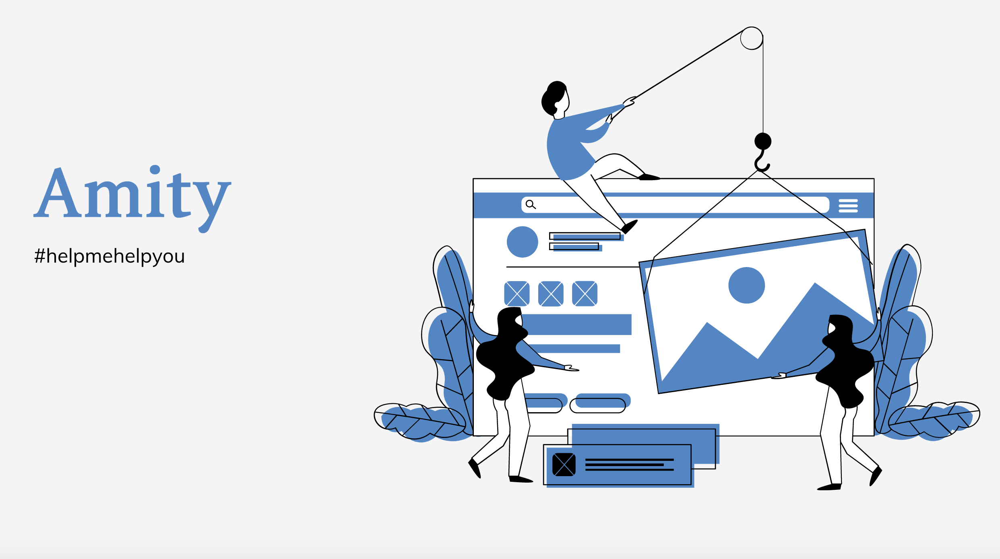

# Amity

Amity is a machine learning model identifying users in social media sites with deteriorating mental health to connect them with resources and help. 

Covid-19 has had a serious impact on the mental health of many teenagers and young adults. During the pandemic, social media has been one of the ways that we have managed to stay connected in a virtual world. Unfortunately, it has also lead to increases in posts about suicidal behaviour/ideation, as well as increases in suicide attempts. Studies have shown that suicidal ideation was higher in March 2020 by 1.6x compared to 2019. In a remote world, it can be hard to seek help or even realise that you need help. 

Amity would help social media platforms protect the mental health of their users by – with user consent – analyzing user text using NLP to see whether their sentiments are "at-risk" or not. In the future, we hope products like Amity can be integrated into ecosystems to improve digital mental health.

